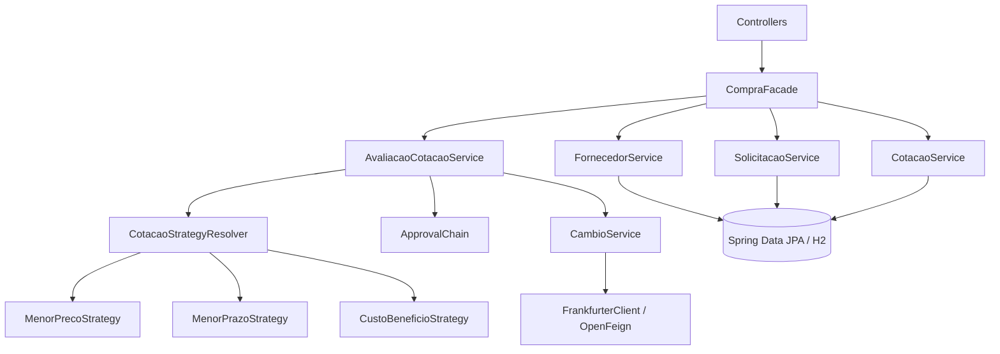

# Arquitetura do CompraFlow

## Componentes

## Princípios usados

- controllers finos;
- regras de negócio em services/domínio;
- dependências por construtor;
- DTOs separados das entidades JPA;
- enums para estados e critérios;
- validação na borda HTTP;
- exceções específicas para diferentes classes de erro;
- extensão de algoritmos por Strategy.
